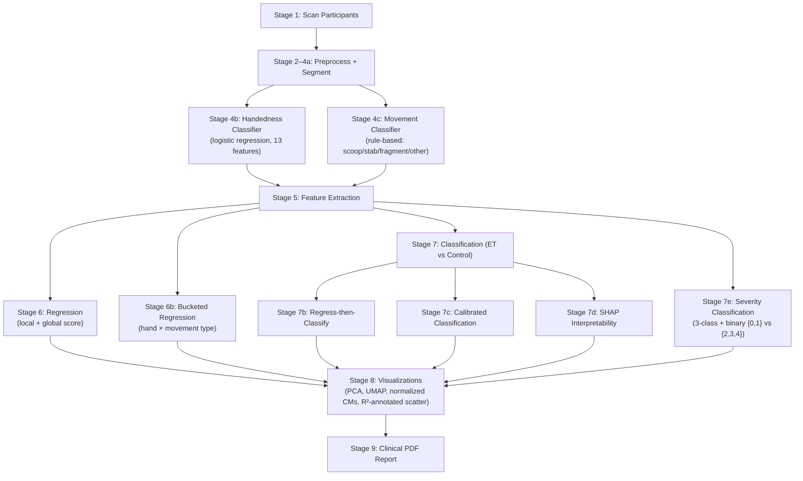

# Fork ET Detection Pipeline

## Overview

An automated pipeline for detecting and quantifying Essential Tremor (ET) during fork-based eating tasks. Analyses IMU sensor data (accelerometer + gyroscope) mounted on the patient's hand and predicts clinical tremor scores.

### Capabilities

- **Automatic scanning** of participant data (ET and Control groups)
- **216 features** extracted across 13 feature groups (time-domain, frequency, wavelet, spectral, tremor-specific, temporal + **Age and Gender**)
- **13-feature hand classifier** — logistic regression with chirality-sensitive gyro + gravity-projection features
- **Rule-based movement classifier** — deterministic scoop/stab/fragment/other labels from biomechanical thresholds (no GMM, no retraining)
- **VarianceThreshold & RFE** — removes constant features and automatically selects optimal 25 features
- **Class Balancing** — class_weight / scale_pos_weight on all models (SMOTE removed; see note below)
- **8 ML models** with Leave-One-Subject-Out (LOSO) cross-validation
- **Regression** — clinical tremor score prediction (R²=0.63, Pearson r=0.83 Local Score, LOSO)
- **Classification** — ET vs Control (AUC=0.67, Specificity=0.80 at patient level)
- **Youden's J threshold optimization** — balances Sensitivity/Specificity
- **Calibrated Classifiers** — Platt scaling for reliable probabilities
- **Regress-then-classify** — uses regression score to classify ET
- **SHAP Interpretability** — visualizes feature importance for regression and classification
- **RFE Feature Stability** — tracks which features survive the LOSO cross-validation splits
- **Automated PDF Report** — clinical report with all metrics, figures, and SHAP/RFE tables
- **Clinical metrics**: Sensitivity, Specificity, PPV, NPV, Pearson r, Spearman ρ
- **Binary severity classification** — {0,1} vs {2,3,4} on raw per-item TETRAS cells (`run_binary_severity_classification`)
- **Train vs CV R² reporting** — train-fold and CV R² both annotated on scatter plots to expose overfitting gap
- **Normalized confusion matrices** — two-panel (raw counts + row-normalised recall) for binary and severity CMs
- **UMAP visualization** — 2-D EDA scatter colored by label (named features kept as model inputs)
- **Clinical visualizations**: Confusion Matrix (normalized), Bland-Altman, ROC, PCA, UMAP, SHAP plots

---

## Research Knowledge Base

Empirical foundation extracted from prior work on sister projects (Cup drinking thesis, Toothbrush study) — see [`research_knowledge_base.md`](research_knowledge_base.md).

Covers: filter cutoffs, activity-detection thresholds, cycle segmentation strategy, gravity/tilt handling (magnitude-based, tilt-invariant), handedness conventions, tremor signal model (slow + daily + fast components), 10-second sliding-window feature extraction, top discriminative features, and final reported metrics. This is the source of truth for design decisions in the upcoming segmentation/handedness/movement-type pipeline.

---

## Quick Start

```bash
# Install dependencies
pip install -r requirements.txt

# Run the pipeline
cd Fork
python main.py
```

Results are saved to `Fork/output/figures/`.

---

## Project Structure

```
Fork/
├── main.py                 # Orchestrator - 9-stage pipeline
├── config.py               # All configuration parameters (incl. RULE_* thresholds)
├── data_loader.py          # File scanning + CRF Excel parsing
├── preprocessing.py        # Filtering, magnitude, activity detection
├── handedness.py           # Logistic regression hand classifier (13 chirality features)
├── movement_classifier.py  # Rule-based movement-type classifier (scoop/stab/fragment/other)
├── feature_extraction.py   # 13 feature groups (216 features)
├── ml_pipeline.py          # 8 models, LOSO CV, tuning, augmentation, SHAP, calibration
├── visualization.py        # Plot generation
├── report_generator.py     # Automated PDF clinical report (fpdf2)
├── utils.py                # Logging, label normalization
├── requirements.txt        # Dependencies
└── output/
    └── figures/            # Generated plots + clinical_report_*.pdf
                            # cluster_inspection.pdf  ← validate RULE_* thresholds here
```

---

## Pipeline Architecture



### Stage 1 — Scanning Participants
**File:** `data_loader.py` → `scan_participants()`

Recursively traverses `New Data/משתתפים/`, finds `ET-XXX` and `Control-XXX` folders, discovers Fork CSV files (`Fork1_*.csv`, `Fork2_*.csv`, `Fork_*.csv`).

- `Fork1` → right hand, `Fork2` → left hand
- `Fork_` (no digit) → included with configurable default hand
- **Result:** 105 CSV files from 24 patients (ET=22, Control=10)

### Stage 2 — Loading Clinical Scores
**File:** `data_loader.py` → `load_crf_scores()`

Parses the CRF Excel file (`HIT Study CRF - No personal Data.xlsx`):
- **Local score** — averaged fork score (scooping + stabbing) for the specific hand
- **Global score** — `Subtotal B Ext` (overall extremity test score)
- Supports Hebrew hand labels (ימין/שמאל)

### Stages 2–4a — Preprocessing & Segmentation
**Files:** `preprocessing.py`, `data_loader.py`

1. **Robust cleaning** — percentile outlier clipping, spike rejection, Savitzky-Golay smoothing
2. **Bandpass filter** — 4th-order Butterworth 0.5–20 Hz (features) and 2–15 Hz (segmentation)
3. **Activity detection (Cup criterion)** — `|a'| + |ω'| + ||a|−1| ≥ τ₁` AND `|ω−ω_min| ≥ τ₂`, rolling window, gap fill, duration bounds
4. **Cycle quality** — fragment vs real cycle via tilt range + jerk ratio

### Stage 4b — Handedness Classifier
**File:** `handedness.py`

Logistic regression trained on labeled cycles (`Fork1`=Right, `Fork2`=Left). Predicts hand for ambiguous `Fork_` files. 13 chirality-sensitive features:

| Feature group | Features |
|---|---|
| Rotation asymmetry | `gyro_y_asym` (p95+p05), `skew_gyro_y/z`, `weighted_mean_gy` |
| Cross-axis chirality | `corr_ax_gy`, `corr_az_gx`, `corr_ay_gy`, `corr_ay_gz` |
| Gravity projection | `mean_acc_y`, `mean_acc_z`, `skew_acc_y` (static wrist tilt differs per hand) |
| Net rotation | `mean_gy`, `mean_gz` |

> **Limitation:** LOSO accuracy is ~65% due to class imbalance (378 Right vs 32 Left cycles). More Fork2 recordings are needed to improve this reliably.

### Stage 4c — Movement-Type Classifier
**File:** `movement_classifier.py`

Rule-based classifier — no training required. Rules are applied in order:

| Priority | Label | Condition |
|---|---|---|
| 1 | **fragment** | `duration < 2.0 s` AND `jerk_ratio < 2.5` |
| 2 | **scoop** | `acc_y_range > acc_z_range × 0.8` AND `gy_std > gx_std` AND peak jerk at 25–75% of cycle |
| 3 | **stab** | `acc_z_range > acc_y_range × 0.8` AND peak jerk in first 55% of cycle |
| 4 | **other** | everything else |

All thresholds are `RULE_*` constants in `config.py`. Tune by inspecting `cluster_inspection.pdf` — no retraining needed.

**Why rules instead of GMM:** Movement types are biomechanically defined, not discovered. GMM produced unstable cluster identities (random seed dependent) and collapsed 65% of all cycles into "other" with no reliable post-hoc label assignment.

### Stage 5 — Feature Extraction & Patient Signal Plotting
**Files:** `feature_extraction.py`, `visualization.py`

For each recording, a per-channel signal plot (accelerometer + gyroscope) is saved to `output/figures/patient_signals/`.

13 feature groups yielding **214 features** per segment:

| # | Group | Description | 
|---|-------|-------------|
| 1 | Time-domain | mean, std, rms, max, min, range, IQR, kurtosis, skewness | 
| 2 | Jerk | Acceleration derivative (mean, std, rms) | 
| 3 | Cross-axis | Correlation between axis pairs (9 pairs) | 
| 4 | Magnitude | acc_mag, gyro_mag: mean, std, rms, range, peak | 
| 5 | Frequency | Dominant/median frequency, ET-band (4–12 Hz) power | 
| 6 | Spectral shape | Entropy, flatness, centroid, rolloff | 
| 7 | Wavelet CWT | Morlet wavelet energy and ratio in 4–12 Hz | 
| 8 | Weighted spectral | Weighted mean/median/max freq, std, skewness | 
| 9 | Peak-to-peak | Min/mean/median peak intervals, peak frequency + duration | 
| 10 | Tremor-specific | Tremor Stability Index (TSI), Tremor Power Ratio, Harmonic-to-Noise Ratio (HNR) |
| 11 | Multi-resolution CWT | CWT energy variance/CV/trend across 2-sec windows |
| 12 | Dual bandpass (3–15 Hz) | Narrow tremor-band RMS, std, max, energy ratio |
| 13 | Temporal | Autocorrelation at ET-band lags, sample entropy |

### Stage 5 — Regression
**File:** `ml_pipeline.py` → `run_regression()`

Predicts clinical tremor score. Runs only on ET patients.

**Models:**
| Model | Description |
|-------|-------------|
| LinearRegression | Baseline linear model |
| Ridge | L2 regularization (α=1.0) |
| Lasso | L1 regularization (α=0.1) |
| RandomForest | Ensemble of trees (tuned via GridSearchCV) |
| GradientBoosting | Gradient boosting (100 trees) |
| XGBoost | Extreme gradient boosting (tuned via GridSearchCV) |
| StackingEnsemble | Stacking of all models, RidgeCV meta-learner |

**Capabilities:**
- **LOSO CV** — Leave-One-Subject-Out cross-validation (no data leakage)
- **Data augmentation** — noise injection + mixup (`augment_and_balance()`)
- **RF importance** — feature selection via RandomForest importance 
- **GridSearchCV** — automatic hyperparameter tuning

### Stage 6 — Classification
**File:** `ml_pipeline.py` → `run_classification()`

Binary classification: ET vs Control. Includes **Youden's J threshold optimization** for each model to balance Sensitivity and Specificity.

**Additional models:**
- **SVC** — with `class_weight` for imbalance handling 
- **GradientBoosting** — classifier

### Stage 6b — Regress-then-Classify
**File:** `ml_pipeline.py` → `run_regress_then_classify()`

Alternative classification approach: predicts tremor score for ALL patients (Controls get score=0, ET patients get their actual CRF score), then classifies as ET if predicted score > threshold. Leverages the stronger regression model for binary decision.

Includes Youden's J optimization for the score threshold.

### Stage 6c — Calibrated Classification
**File:** `ml_pipeline.py` → `run_calibrated_classification()`

Classification with `CalibratedClassifierCV` (Platt scaling) for reliable probability predictions in clinical settings. 

### Stage 6d — SHAP Interpretability
**File:** `ml_pipeline.py` → `run_shap_analysis()`

Visualizes feature importance using `shap.TreeExplainer`. Generates bar plots and beeswarm plots for the best regression and classification models to identify the most predictive clinical biomarkers.

### Stage 7 — Visualization
**File:** `visualization.py`

| Plot | File | Purpose |
|------|------|---------|
| Patient Signals | `patient_signals/{group}_{id}_run{n}.png` | Acc + Gyro per recording |
| PCA 2D | `pca_et_vs_control.png` | ET vs Control projection |
| UMAP 2D | `umap_et_vs_control.png` | EDA scatter (UMAP, colored by is_et) |
| Boxplot | `boxplot_features.png` | Feature distributions by group |
| Activity | `activity_XXX.png` | Detected activity segments |
| Scatter | `scatter_local_score.png` | Predicted vs True scores (train R² + CV R² annotated) |
| Bland-Altman | `bland_altman_local.png` | Clinical validation standard |
| Confusion Matrix | `confusion_matrix.png` | 2-panel: raw counts + row-normalised recall |
| Severity CM | `severity_cm_local.png` / `severity_cm_global.png` | 3-class severity (2-panel) |
| ROC | `roc_et_vs_control.png` | ROC curve with AUC |
| SHAP Bar | `shap_bar_*.png` | Top feature global importances |
| SHAP Beeswarm | `shap_beeswarm_*.png` | Feature impact distributions |

---

## Configuration

All parameters in `config.py`:

**Signal & ML parameters:**

| Parameter | Value | Description |
|-----------|-------|-------------|
| `FS` | 100 | Sampling frequency (Hz) |
| `LOWPASS_HZ` / `HIGHPASS_HZ` | 20.0 / 0.5 | Filter passband |
| `ET_FREQ_LOW` / `ET_FREQ_HIGH` | 4.0 / 12.0 | Tremor frequency band |
| `MIN_SEGMENT_SEC` | 3.0 | Minimum activity segment duration |
| `USE_LOSO` | True | LOSO cross-validation |
| `TUNE_HYPERPARAMS` | False | GridSearchCV (disabled — overfitting risk) |
| `USE_STACKING` | False | Stacking ensemble (disabled — overfitting risk) |
| `USE_AUGMENTATION` | False | Data augmentation (disabled — overfitting risk) |
| `PER_SEGMENT` | True | Per-segment predictions |
| `TOP_K_FEATURES` | 25 | Features selected by RFE |
| `INCLUDE_AMBIGUOUS_FORK` | True | Include Fork_*.csv files |
| `SEVERITY_BINARY_THRESHOLD` | 2 | Raw TETRAS cell value: < 2 → "Low" {0,1}, ≥ 2 → "High" {2,3,4} |
| `SEVERITY_BINARY_LABELS` | ["Low","High"] | Labels for binary severity classification |

**Rule-based movement classifier thresholds (`RULE_*`):**

| Parameter | Default | Description |
|-----------|---------|-------------|
| `RULE_FRAGMENT_MAX_DUR` | 2.0 s | Max duration for a cycle to be labelled fragment |
| `RULE_FRAGMENT_MAX_JERK_RATIO` | 2.5 | Max peak/mean jerk for fragment |
| `RULE_SCOOP_MIN_ACC_Y_RANGE` | 0.3 g | Min lateral tilt range for scoop |
| `RULE_SCOOP_TILT_RATIO` | 0.8 | acc_y_range must exceed acc_z_range × this |
| `RULE_SCOOP_GYRO_RATIO` | 1.0 | gy_std must exceed gx_std × this |
| `RULE_SCOOP_PEAK_JERK_MIN/MAX` | 0.25 / 0.75 | Normalised cycle position of peak jerk |
| `RULE_STAB_MIN_ACC_Z_RANGE` | 0.3 g | Min vertical range for stab |
| `RULE_STAB_VERT_RATIO` | 0.8 | acc_z_range must exceed acc_y_range × this |
| `RULE_STAB_PEAK_JERK_MAX` | 0.55 | Peak jerk must fall in the first 55% of cycle |

---

## Current Results (Stage 23, LOSO CV, 381 segments, 24 patients)

### Regression — Local Score (ET only)

| Model | MAE | R² | Pearson r |
|-------|-----|-----|----------|
| LinearRegression | 0.538 | 0.618 | 0.819 |
| **Ridge** | **0.536** | **0.628** | **0.828** |
| Lasso | 0.566 | 0.611 | 0.844 |
| RandomForest | 0.566 | 0.594 | 0.796 |

### Classification — ET vs Control (patient-level, Specificity ≥ 0.80 target)

| Model | Sensitivity | Specificity | AUC |
|-------|-------------|-------------|-----|
| SVC_calibrated_patient | 0.357 | **0.800** | 0.671 |
| RF_calibrated_patient | 0.357 | **0.800** | 0.564 |
| LR_Youden | 0.686 | 0.591 | 0.651 |
| XGBoost_Youden | 0.730 | 0.545 | 0.632 |

### SHAP Top Biomarkers (current run)
- **Regression:** `gyro_y_cwt_energy_ratio` (0.25), `gyro_p2p_mean` (0.17), `gyro_mag_ptp` (0.11)
- **Classification:** `gyro_wt_mean_freq` (0.81), `gyro_x_spec_rolloff` (0.62), `corr_acc_y_acc_z` (0.57)

> Sensitivity at the Specificity=0.80 constraint is limited by the small cohort (24 patients) and the class imbalance in labeled hand data. Regression performance is solid (r=0.83) and is the more reliable signal at this dataset size.

---

## Dependencies

```
numpy>=1.24
pandas>=2.0
scipy>=1.10
scikit-learn>=1.3
matplotlib>=3.7
openpyxl>=3.1
xgboost>=2.0
shap>=0.42
imbalanced-learn>=0.11
fpdf2>=2.7
umap-learn>=0.5
```

> **Note on class balancing:** SMOTE was removed from the classification pipeline. It operated at the segment level and interpolated between samples from different patients, leaking patient identity across LOSO folds and distorting decision boundaries at small N. Class imbalance is handled entirely via `class_weight="balanced"` / `scale_pos_weight` on each model.

---

## Data

Data is located in `New Data/משתתפים/` organized by patient folders:

```
New Data/משתתפים/
├── ET-005/          # ET patient
│   ├── Fork1_*.csv  # Using device 1
│   └── Fork2_*.csv  # Using device 2
├── Control-001/     # Control patient
│   └── Fork1_*.csv
└── ...
```

> **Note:** The recording device operated in an "append" mode meaning late-session CSV files contained all previous tests. The pipeline automatically deduplicates these files and isolates tests **behaviorally**: a new test begins organically wherever the physical time gap between *two distinct eating cycles* (reach-pierce-bring) exceeds 10,000 ms.
> It also dynamically infers the left/right hand for *each behavioral test* via a majority vote across all valid gestures within that sequence.

CSV format (10 columns): timestamp (Unix ms), counter, datetime, battery, acc_x, acc_y, acc_z, gyro_x, gyro_y, gyro_z.

CRF scores are stored in: `HIT Study CRF - No personal Data.xlsx`.

